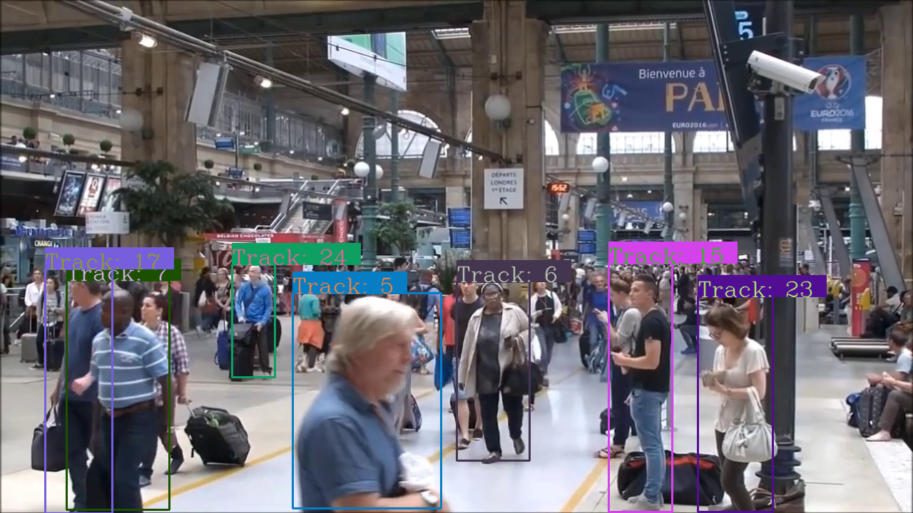
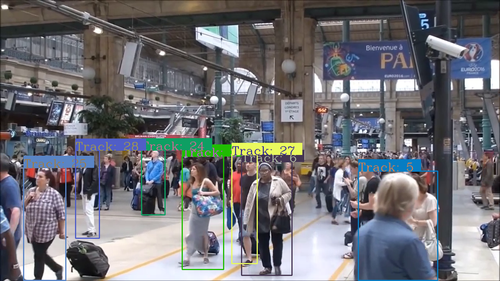

## Introduction
This repo is an example of human detection and tracking in videos. [OpenCV DNN](https://docs.opencv.org/master/d6/d0f/group__dnn.html) is used to run the detector model. 

## Algorithms 
- Person Detection: [YOLOv4](https://arxiv.org/abs/2004.10934). Download YOLOv4 weights from [here](https://github.com/AlexeyAB/darknet/releases/download/darknet_yolo_v3_optimal/yolov4.weights).
- Tracking: [DeepSORT](https://github.com/nwojke/deep_sort)

## Libraries
- OpenCV Python == 4.5.3.56
- Tensorflow == 2.5.0 (GPU version)

**Note: If you are compiling OpenCV from sources do not forget to enable OpenCVDNN.**
```
DCUDA_ARCH_BIN=6.1 (Your GPU compute capability)
DOPENCV_DNN_CUDA=ON)
```

## Steps
1. Clone the repository.
2. Create a new python virtual environment
3. Install dependencies.
4. Run the example.
   
```
$ python3 -m venv venv

$ source venv/bin/activate

$ pip install -r requirements.txt

$ python3 main.py 
```

## Sample results
[Result 1]: https://github.com/adam-p/markdown-here/raw/master/src/common/images/icon48.png "Logo Title Text 2"



